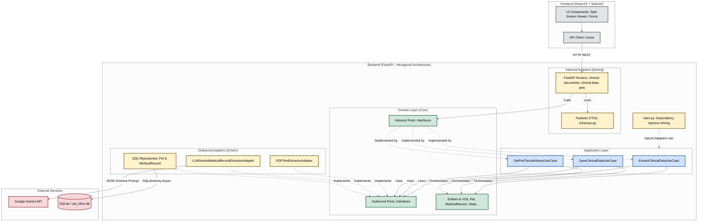

```mermaid
%%{init: {'theme': 'neutral'}}%%
graph TD
    subgraph Frontend ["Frontend (ReactJS + Tailwind)"]
        UI[UI Components: Split-Screen Viewer, Forms]
        ClientAPI[API Client / Axios]
    end

    subgraph Backend ["Backend (FastAPI - Hexagonal Architecture)"]
        
        subgraph Inbound ["Inbound Adapters (Driving)"]
            Router[FastAPI Routers: clinical-documents, clinical-data, pets]
            DTOs[Pydantic DTOs: schemas.py]
        end

        subgraph App ["Application Layer"]
            UC1[ExtractClinicalDataUseCase]
            UC2[SaveClinicalDataUseCase]
            UC3[GetPetClinicalHistoryUseCase]
        end

        subgraph Domain ["Domain Layer (Core)"]
            InPorts[Inbound Ports: Interfaces]
            OutPorts[Outbound Ports: Interfaces]
            Models[Entities & VOs: Pet, MedicalRecord, Vitals...]
        end

        subgraph Outbound ["Outbound Adapters (Driven)"]
            PDF[PDFTextExtractorAdapter]
            LLMAdapt[LLMGeminiMedicalRecordExtractorAdapter]
            Repo[SQL Repositories: Pet & MedicalRecord]
        end
        
        DI[main.py: Dependency Injection Wiring]
    end

    subgraph External ["External Services"]
        Gemini[Google Gemini API]
        DB[(SQLite / vet_clinic.db)]
    end

    %% Frontend to Backend Flow
    UI --> ClientAPI
    ClientAPI -->|HTTP REST| Router

    %% Inbound to App
    Router -->|Uses| DTOs
    Router -->|Calls| InPorts
    InPorts -. Implemented by .-> UC1
    InPorts -. Implemented by .-> UC2
    InPorts -. Implemented by .-> UC3

    %% App to Domain
    UC1 -->|Uses| OutPorts
    UC2 -->|Uses| OutPorts
    UC3 -->|Uses| OutPorts
    
    UC1 -->|Orchestrates| Models
    UC2 -->|Orchestrates| Models
    UC3 -->|Orchestrates| Models

    %% Adapters implement Outbound Ports (Dependency Inversion)
    PDF -. Implements .-> OutPorts
    LLMAdapt -. Implements .-> OutPorts
    Repo -. Implements .-> OutPorts

    %% DI injects Adapters into Use Cases
    DI -. Injects Adapters into .-> App

    %% Outbound to External
    LLMAdapt -->|JSON Schema Prompt| Gemini
    Repo -->|SQLAlchemy Async| DB
    
    %% BULLETPROOF STYLING (Applied to nodes, high contrast, black text)
    classDef frontendNode fill:#e2e3e5,stroke:#41464b,stroke-width:2px,color:#000000;
    classDef adapterNode fill:#fff3cd,stroke:#664d03,stroke-width:2px,color:#000000;
    classDef appNode fill:#cfe2ff,stroke:#084298,stroke-width:2px,color:#000000;
    classDef domainNode fill:#d1e7dd,stroke:#0f5132,stroke-width:2px,color:#000000;
    classDef externalNode fill:#f8d7da,stroke:#842029,stroke-width:2px,color:#000000;

    class UI,ClientAPI frontendNode;
    class Router,DTOs,PDF,LLMAdapt,Repo,DI adapterNode;
    class UC1,UC2,UC3 appNode;
    class InPorts,OutPorts,Models domainNode;
    class Gemini,DB externalNode;
```