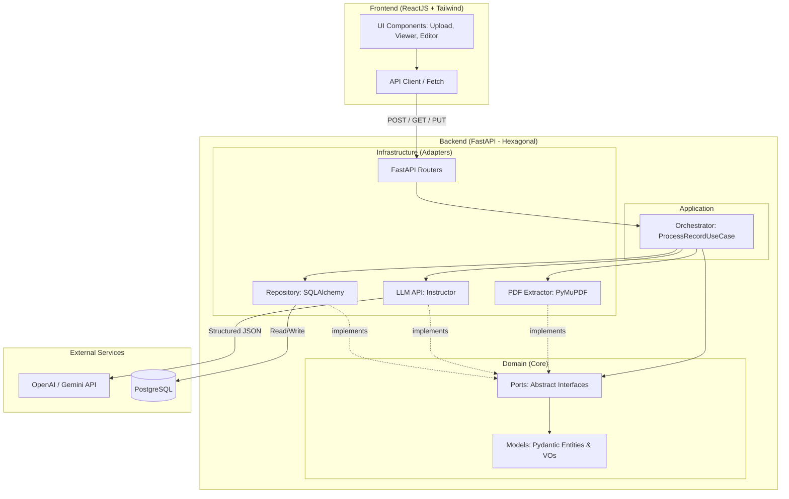

```mermaid
graph TD
    subgraph Frontend ["Frontend (ReactJS + Tailwind)"]
        UI[UI Components: Upload, Viewer, Editor]
        ClientAPI[API Client / Fetch]
    end

    subgraph Backend ["Backend (FastAPI - Hexagonal)"]
        
        subgraph Infra ["Infrastructure (Adapters)"]
            Router[FastAPI Routers]
            PDF[PDF Extractor: PyMuPDF]
            LLMAdapt[LLM API: Instructor]
            Repo[Repository: SQLAlchemy]
        end

        subgraph App ["Application"]
            UseCase[Orchestrator: ProcessRecordUseCase]
        end

        subgraph Domain ["Domain (Core)"]
            Ports[Ports: Abstract Interfaces]
            Models[Models: Pydantic Entities & VOs]
        end
    end

    subgraph External ["External Services"]
        OpenAI[OpenAI / Gemini API]
        DB[(PostgreSQL)]
    end

    UI --> ClientAPI
    ClientAPI -->|POST / GET / PUT| Router

    Router --> UseCase
    UseCase --> Ports
    Ports --> Models
    
    PDF -. implements .-> Ports
    LLMAdapt -. implements .-> Ports
    Repo -. implements .-> Ports
    
    UseCase --> PDF
    UseCase --> LLMAdapt
    UseCase --> Repo

    LLMAdapt -->|Structured JSON| OpenAI
    Repo -->|Read/Write| DB
```