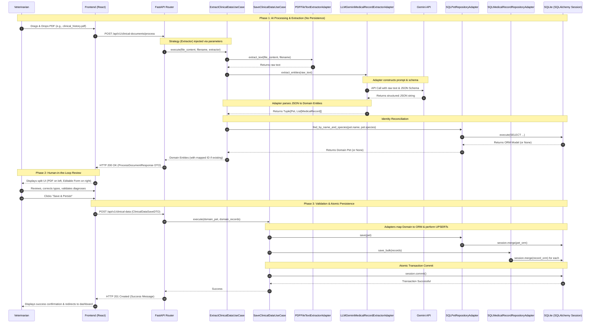

```mermaid
sequenceDiagram
    autonumber
    
    participant User as Veterinarian
    participant FE as Frontend (React)
    participant API as FastAPI Router
    participant ExtUC as ExtractClinicalDataUseCase
    participant SaveUC as SaveClinicalDataUseCase
    participant PDF as PDFFileTextExtractorAdapter
    participant LLMAdapt as LLMGeminiMedicalRecordExtractorAdapter
    participant Gemini as Gemini API
    participant PetRepo as SQLPetRepositoryAdapter
    participant MedRepo as SQLMedicalRecordRepositoryAdapter
    participant DB as SQLite (SQLAlchemy Session)

    Note over User, DB: Phase 1: AI Processing & Extraction (No Persistence)
    
    User->>FE: Drags & Drops PDF (e.g., clinical_history.pdf)
    FE->>API: POST /api/v1/clinical-documents/process
    
    Note over API, ExtUC: Strategy (Extractor) injected via parameters
    API->>ExtUC: execute(file_content, filename, extractor)
    
    ExtUC->>PDF: extract_text(file_content, filename)
    PDF-->>ExtUC: Returns raw text
    
    ExtUC->>LLMAdapt: extract_entities(raw_text)
    
    Note over LLMAdapt,Gemini: Adapter constructs prompt & schema
    LLMAdapt->>Gemini: API Call with raw text & JSON Schema
    Gemini-->>LLMAdapt: Returns structured JSON string
    
    Note over LLMAdapt,ExtUC: Adapter parses JSON to Domain Entities
    LLMAdapt-->>ExtUC: Returns Tuple[Pet, List[MedicalRecord]]
    
    Note over ExtUC, DB: Identity Reconciliation
    ExtUC->>PetRepo: find_by_name_and_species(pet.name, pet.species)
    PetRepo->>DB: execute(SELECT ...)
    DB-->>PetRepo: Returns ORM Model (or None)
    PetRepo-->>ExtUC: Returns Domain Pet (or None)
    
    ExtUC-->>API: Domain Entities (with mapped ID if existing)
    API-->>FE: HTTP 200 OK (ProcessDocumentResponse DTO)
    
    Note over User, FE: Phase 2: Human-in-the-Loop Review
    
    FE-->>User: Displays split UI (PDF on left, Editable Form on right)
    User->>FE: Reviews, corrects typos, validates diagnoses
    User->>FE: Clicks "Save & Persist"
    
    Note over FE, DB: Phase 3: Validation & Atomic Persistence
    
    FE->>API: POST /api/v1/clinical-data (ClinicalDataSaveDTO)
    API->>SaveUC: execute(domain_pet, domain_records)
    
    Note over SaveUC, DB: Adapters map Domain to ORM & perform UPSERTs
    SaveUC->>PetRepo: save(pet)
    PetRepo->>DB: session.merge(pet_orm)
    
    SaveUC->>MedRepo: save_bulk(records)
    MedRepo->>DB: session.merge(record_orm) for each
    
    Note over SaveUC, DB: Atomic Transaction Commit
    SaveUC->>DB: session.commit()
    DB-->>SaveUC: Transaction Successful
    
    SaveUC-->>API: Success
    API-->>FE: HTTP 201 Created (Success Message)
    FE-->>User: Displays success confirmation & redirects to dashboard
```