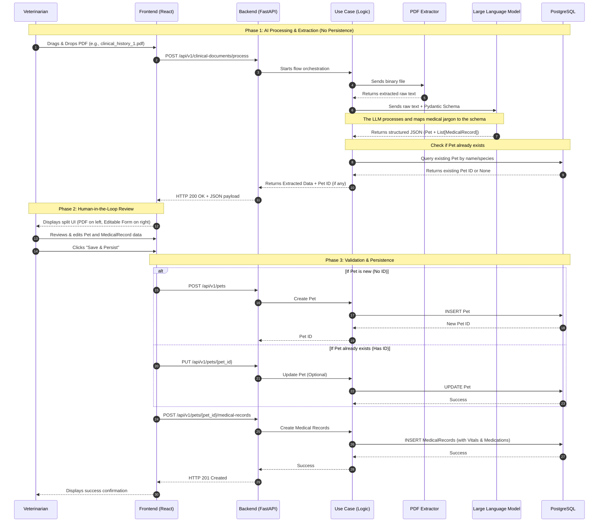

```mermaid
sequenceDiagram
    autonumber
    
    participant User as Veterinarian
    participant FE as Frontend (React)
    participant API as Backend (FastAPI)
    participant Core as Use Case (Logic)
    participant PDF as PDF Extractor
    participant LLM as Large Language Model
    participant DB as PostgreSQL

    Note over User, DB: Phase 1: AI Processing & Extraction (No Persistence)
    
    User->>FE: Drags & Drops PDF (e.g., clinical_history_1.pdf)
    FE->>API: POST /api/v1/clinical-documents/process
    API->>Core: Starts flow orchestration
    
    Core->>PDF: Sends binary file
    PDF-->>Core: Returns extracted raw text
    
    Core->>LLM: Sends raw text + Pydantic Schema
    Note over Core,LLM: The LLM processes and maps medical jargon to the schema
    LLM-->>Core: Returns structured JSON (Pet + List[MedicalRecord])
    
    Note over Core, DB: Check if Pet already exists
    Core->>DB: Query existing Pet by name/species
    DB-->>Core: Returns existing Pet ID or None
    
    Core-->>API: Returns Extracted Data + Pet ID (if any)
    API-->>FE: HTTP 200 OK + JSON payload
    
    Note over User, FE: Phase 2: Human-in-the-Loop Review
    
    FE-->>User: Displays split UI (PDF on left, Editable Form on right)
    User->>FE: Reviews & edits Pet and MedicalRecord data
    User->>FE: Clicks "Save & Persist"
    
    Note over FE, DB: Phase 3: Validation & Persistence
    
    alt If Pet is new (No ID)
        FE->>API: POST /api/v1/pets
        API->>Core: Create Pet
        Core->>DB: INSERT Pet
        DB-->>Core: New Pet ID
        Core-->>API: Pet ID
    else If Pet already exists (Has ID)
        FE->>API: PUT /api/v1/pets/{pet_id}
        API->>Core: Update Pet (Optional)
        Core->>DB: UPDATE Pet
        DB-->>Core: Success
    end
    
    FE->>API: POST /api/v1/pets/{pet_id}/medical-records
    API->>Core: Create Medical Records
    Core->>DB: INSERT MedicalRecords (with Vitals & Medications)
    DB-->>Core: Success
    Core-->>API: Success
    
    API-->>FE: HTTP 201 Created
    FE-->>User: Displays success confirmation
```