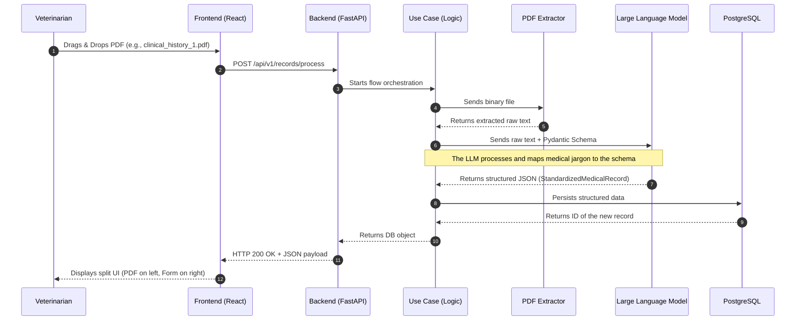

```mermaid
sequenceDiagram
    autonumber
    participant User as Veterinarian
    participant FE as Frontend (React)
    participant API as Backend (FastAPI)
    participant Core as Use Case (Logic)
    participant PDF as PDF Extractor
    participant LLM as Large Language Model
    participant DB as PostgreSQL

    User->>FE: Drags & Drops PDF (e.g., clinical_history_1.pdf)
    FE->>API: POST /api/v1/records/process
    API->>Core: Starts flow orchestration
    
    Core->>PDF: Sends binary file
    PDF-->>Core: Returns extracted raw text
    
    Core->>LLM: Sends raw text + Pydantic Schema
    Note over Core,LLM: The LLM processes and maps medical jargon to the schema
    LLM-->>Core: Returns structured JSON (StandardizedMedicalRecord)
    
    Core->>DB: Persists structured data
    DB-->>Core: Returns ID of the new record
    
    Core-->>API: Returns DB object
    API-->>FE: HTTP 200 OK + JSON payload
    
    FE-->>User: Displays split UI (PDF on left, Form on right)
```